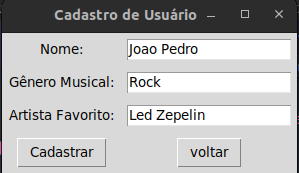
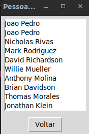

# Recomenda oSocial

**Número da Lista**: 1 
**Conteúdo da Disciplina**: Grafos 1 - Busca em Grafos 

## Alunos

| Matrícula  | Aluno               |
| ---------- | ------------------- |
| 20/0020625 | João Pedro Anacleto |
| 20/0072854 | Bruno Seiji Kishibe |

## Sobre

O projeto tem o objetivo de a a partir de um artista escolhido pelo usuario identificar utilizando grafos e suas buscas outros usuarios que tem o mesmo artista favorito em comum.A ideia desse projeto foi inspirada nas aplicações de redes sociais de grafos aonde podemos utilizar a busca para obter uma recomendação de usuarios.

## Screenshots

### Tela de busca da aplicação

### Tela de cadastro do usuario para busca

### Tela de recomendação de usuarios

## Instalação

**Linguagem**: python 
**Bibliotecas**:Pandas,Numpy,Faker,Tkinter

Para rodar o projeto sera necessario o [python](https://www.python.org/downloads/) em sua versao mais recente.As bibiliotecas Tkinter,Pandas,Numpy e Faker.

1 - Instale a versao mais recente do python e o gerenciador de pacotes pip em sua maquina.
2 - Instale as seguintes bibliotecas com os seguintes comandos.

- pip install tk
- pip install pandas
- pip install numpy
- pip install faker

## Uso

1 - Clone o projeto deste repositorio em uma pasta com o seguinte comando:

- git clone https://github.com/projeto-de-algoritmos/Grafos1_Recomenda-oSocial.git

2 - Apos clonar este repositorio

- Clique com o botao direito na pasta do repositorio e abra ela no terminal
- Apos aberto no terminal execute o seguinte comando para executar a aplicação: python3 interface.py

## Outros

Caso os comando python3 interface.py nao abra executa alguns destes comandos python interface.py.

## Apresentação

[Apresentação](src/apresentacao/apresentação.mp4)

<iframe src="https://unbbr.sharepoint.com/sites/ProjetoAlgoritimo-trabalhos/_layouts/15/embed.aspx?UniqueId=134de4fb-6f72-4fd9-9efe-481c1caa5a89&embed=%7B%22ust%22%3Atrue%2C%22hv%22%3A%22CopyEmbedCode%22%7D&referrer=StreamWebApp&referrerScenario=EmbedDialog.Create" width="640" height="360" frameborder="0" scrolling="no" allowfullscreen title="Apresentação"></iframe>
